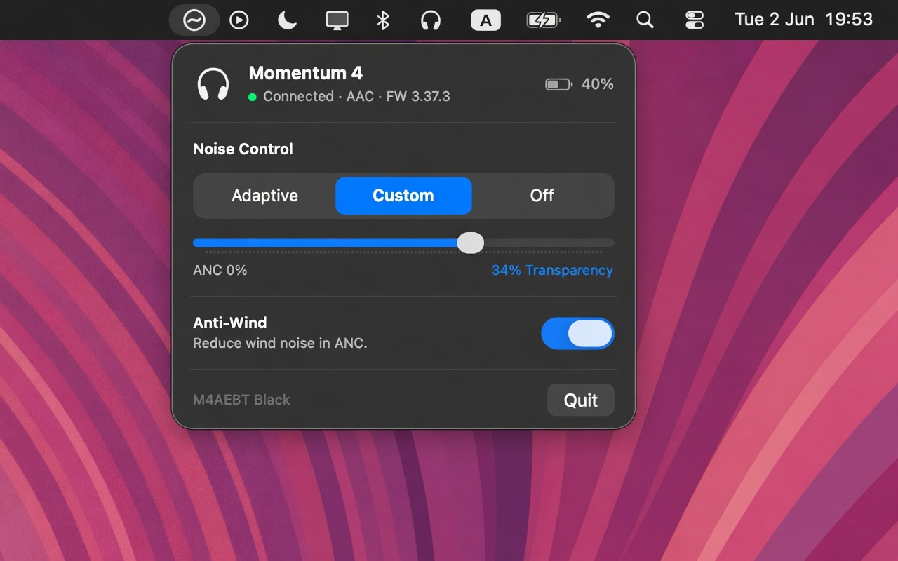

# Momentum

A native macOS **menu bar app** to control your **Sennheiser Momentum 4**'s noise
cancellation and transparency — without opening your phone. Switch between
**Adaptive · Custom · Off** and drag a single **ANC ↔ Transparency** slider, right
from the menu bar.

> **Unofficial.** Not affiliated with, authorized, or endorsed by Sennheiser or
> Sonova. It talks to the headphones over their own Bluetooth control protocol,
> reverse-engineered by the community. Use at your own risk.

<p align="center">
  
</p>

## Features

- **Noise control modes** — Adaptive · Custom · Off, matching Sennheiser's Smart Control app.
- **Bidirectional slider** (Custom mode) — one control from full **ANC** through neutral to full **Transparency**.
- **Anti-Wind** toggle (Custom mode) — reduces wind noise in ANC.
- **Live device info** — battery %, active codec, firmware version, model, connection state.
- **Launch at Login** — optional, toggle it from the popover.
- **Stays in sync** — reflects changes you make physically on the headphones or from the phone app.
- Lightweight menu bar app; talks **directly** to the headphones over Bluetooth (no companion service).

## Requirements

- **macOS 14+** (built with the macOS 26 SDK it adopts the Liquid Glass design).
- A **Sennheiser Momentum 4** paired and connected to this Mac.
- A Swift toolchain — Xcode or the Command Line Tools (`xcode-select --install`).

## Build & run

```sh
./build.sh         # swift build (release) + assemble + ad-hoc sign Momentum.app
open Momentum.app  # launch — click "Allow" on the Bluetooth prompt
```

On first launch macOS asks for **Bluetooth permission**; it's required (the app
can't reach the headphones without it). Because the app is ad-hoc signed, macOS
re-asks after each rebuild — grant it again, or sign with a stable identity.

## Usage

Click the menu bar glyph to open the popover:

- **Adaptive** — ANC auto-adjusts to your surroundings.
- **Custom** — the slider blends ANC ↔ Transparency (`ANC 100% … neutral … 100% Transparency`).
- **Off** — no cancellation or passthrough.
- **Anti-Wind** (Custom only) — toggle wind-noise reduction.

## How it works

The Momentum 4 is controlled over Qualcomm's **GAIA V3** protocol on a **Bluetooth
Classic RFCOMM** channel (the device advertises it as an SDP service named
`"GAIA"`). The app frames GAIA packets, runs all `IOBluetooth` work on a dedicated
thread, and maps the UI to the device's `ANC_Status` / `ANC_Transparency` /
ANC sub-mode commands.

The full protocol map, feature semantics, and the (many) macOS/IOBluetooth gotchas
are documented in [`CLAUDE.md`](CLAUDE.md).

## Troubleshooting

- **Stuck "Searching…"** — make sure the M4 is powered on and connected to *this*
  Mac (Bluetooth multipoint may have it on your phone instead).
- **Connection hangs / every open fails** — the M4 allows only **one** GAIA control
  connection. If a process held it and died without closing, the channel wedges in
  `bluetoothd`. Fix: toggle the **Mac's** Bluetooth off and on (power-cycling the
  headphones is not enough). The app closes the channel cleanly on quit to avoid this.
- **Controls look dated (not Liquid Glass)** — build against the macOS 26 SDK;
  `build.sh` uses the Command Line Tools' `MacOSX26.sdk` automatically when present.

## Development

```
Sources/MomentumKit/   # engine: GAIA framing, RFCOMM transport, controller, model
Sources/Momentum/      # SwiftUI menu bar app
Tests/MomentumKitTests # GAIA framing + slider-model tests  (swift test, needs full Xcode)
```

See [`CLAUDE.md`](CLAUDE.md) for architecture and protocol notes.

## Acknowledgements

The GAIA V3 command map for the Momentum 4 was distilled from the open-source
[`zaval/sennheiser-desktop-client`](https://github.com/zaval/sennheiser-desktop-client),
whose device definition is extracted by decompiling the Smart Control Android app.
This project re-implements the protocol natively in Swift.

## License

[0BSD](LICENSE) (BSD Zero Clause) — do whatever you like with it, no attribution
required, provided **as is** with no warranty. The device protocol itself is
Sennheiser/Sonova's; this repository only covers the original Swift client.
